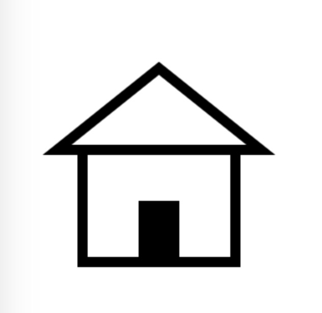

## Relearn Canvas 
> 本章会穿插少量的 `WebGL` 知识, 但不会做过多解释, 感兴趣的可以等待后续 `WebGL`相关的章节。  
> `BTW`: 在学习之前, 您需要具备一些基本的 `HTML` 与 `JavaScript` 知识。  

> 这里使用 `Canvas` 或者 `canvas` 来表示整体概念, 而带有尖角括号的 `<canvas>` 特指 `HTML` 元素。  

### 前言
> 前言内容全部来自 [w3school](https://www.w3school.com.cn/html5/tag_canvas.asp), 我只是个搬运工, 不添加任何内容👏。

#### 1. 历史
这个 `HTML` 元素是为了客户端矢量图形而设计的。它自己没有行为，但却把一个绘图 `API` 展现给客户端 `JavaScript` 以使脚本能够把想绘制的东西都绘制到一块画布上。

`<canvas>` 标记由 `Apple` 在 `Safari 1.3 Web` 浏览器中引入。对 `HTML` 的这一根本扩展的原因在于, `HTML` 在 `Safari` 中的绘图能力也为 `Mac OS X` 桌面的 `Dashboard` 组件所使用, 并且 `Apple` 希望有一种方式在 `Dashboard` 中支持脚本化的图形。

`Firefox 1.5` 和 `Opera 9` 都跟随了 `Safari` 的引领。这两个浏览器都支持 `<canvas>` 标记。

我们甚至可以在 `IE` 中使用 `<canvas>` 标记, 并在 `IE` 的 `VML` 支持的基础上用开源的 `JavaScript` 代码(由 `Google` 发起)来构建兼容性的画布。[详情](http://excanvas.sourceforge.net/)。

`<canvas>` 的标准化的努力由一个 `Web` 浏览器厂商的非正式协会在推进, 目前 `<canvas>` 已经成为 `HTML 5` 草案中一个正式的标签。[详情](http://www.whatwg.org/specs/web-apps/current-work/)。

#### 2. 与 SVG 以及 VML 之间的差异
`<canvas>` 标记和 `SVG` 以及 `VML` 之间的一个重要的不同是, `<canvas>` 有一个基于 `JavaScript` 的绘图 `API`, 而 `SVG` 和 `VML` 使用一个 `XML` 文档来描述绘图。

这两种方式在功能上是等同的, 任何一种都可以用另一种来模拟。从表面上看, 它们很不相同, 可是, 每一种都有强项和弱点。例如, `SVG` 绘图很容易编辑, 只要从其描述中移除元素就行。

要从同一图形的一个 `<canvas>` 标记中移除元素, 往往需要擦掉绘图重新绘制它。

### 一、初识 Canvas
> 为什么不使用 `画布` 这一称呼? 个人喜好🤣

#### 1. 概念
> 接下来是一段枯燥且乏味的基础知识环节~

`<canvas>` 是一个 `HTML` 元素, 它本身**只是**图形容器, 必须使用脚本(通常来说是 `JavaScript`)来绘制图形。拥有多种绘制路径、矩形、圆形、字符以及添加图像的方法, 可以创建丰富的图形引用。例如, 它可以用于绘制图表、制作图片构图或者制作简单的(以及不那么简单的)动画。

`<canvas>` 是一个矩形区域, 可以控制其每一像素。其默认大小为 `300 × 150` 像素(`宽 × 高`, 像素的单位是 `px`)。可以使用 `HTML` 的高度(`height`)和宽度(`width`)属性来自定义 `Canvas` 的尺寸。

#### 2. <canvas> 元素
```html
<canvas class="canvas" id="canvas" width="300" height="150"></canvas>
```

`<canvas>` 标签只有两个特有属性: `width` 和 `height`。而类似于 `class` 与 `id` 标签是每一个 `HTML` 元素都默认具有的属性。

`<canvas>` 标签也可以通过 `css` 来修改样式。**但是**, 这些样式不会影响在 `<canvas>` 中的实际图像。当没有为 `<canvas>` 定制样式时, 它是完全透明。

#### 3. 回退机制
`<canvas>` 本身支持回退机制。当在某些较老的浏览器(尤其是 `IE9` 之前的 `IE` 浏览器)或者[纯文本浏览器](https://baike.baidu.com/item/%E7%BA%AF%E6%96%87%E6%9C%AC%E6%B5%8F%E8%A7%88%E5%99%A8/8789704?fr=aladdin)中使用 `<canvas>` 时, 在这些浏览器上能展示替代内容。

使用起来很容易, 只是在 `<canvas>` 标签中提供了替换内容。而这个原理也非常简单: 当支持 `<canvas>` 的浏览器渲染时, 会自动忽略标签内内容, 只是正常渲染 `<canvas>`; 而不支持的浏览器自然会忽略无法识别的 `<canvas>` 标签渲染其中的内容。

通常使用 `<canvas>` 时都会在其中填写一段类似的话, 例如:
```html
<canvas class="canvas" id="canvas" width="300" height="150">
    Your browser does not support canvas, please use modern browser!
</canvas>
```

如果可以确定 `<canvas>` 只会运行在现代浏览器中或者不考虑回退机制, 也可以不书写回退内容: `<canvas class="no-bug" id="no-bug"></canvas>`。

**⚠️注意**: `</canvas>` 不能省略! 这是由回退机制决定的。如果被省略, 现代浏览器不会渲染 `<canvas>` 之后的所有内容。

### 二、基础用法
#### 1. 渲染上下文
`<canvas>` 元素创造了一个固定大小的区域, 它公开了**一个或多个渲染上下文**, 其可以用来绘制和处理要展示的内容。`canvas` 起初是空白的。为了展示, 首先需要找到渲染上下文, 然后在它的上面绘制。

通过 `getContext()` 获取上下文, 这里主要研究 `2d` 范畴, 所以使用 `canvas.getContext('2d')`, 获取 `CanvasRenderingContext2D` 接口, 该接口为 `Canvas API` 的一部分。

##### 例子:
```js
const canvas = document.getElementById('canvas');
const ctx = cnavas.getContext('2d');
```

#### 2. 支持检测与回退
替换内容是用于在不支持 `<canvas>` 标签的浏览器中展示的。通过简单的测试 `getContext()` 方法的存在, 可以检查 `JavaScript` 编程支持性同时定制一些回退方案(如果不满足于展示一条不支持信息的话)。如:
```js
const canvas = document.getElementById('canvas');
if(canvas.getContext) {
    const ctx = cnavas.getContext('2d');
}else {
    // fallback codes
}
```

#### 3. 简单的完整示例 —— 画个小房子
`HTML`:
```html
<!DOCTYPE html>
<html lang="en">
<head>
    <meta charset="UTF-8">
    <meta name="viewport" content="width=device-width, initial-scale=1.0">
    <title>Canvas Demo</title>
</head>
<body>
    <canvas id="my-canvas" width="300" height="300">
        Your browser does not support canvas, please use modern browser!
    </canvas>
    <script src="./canvas.js"></script>
</body>
</html>
```

`canvas.js`:
```js
window.onload = function () {
    const canvas = document.getElementById('my-canvas');
    if (canvas.getContext) {
        const ctx = canvas.getContext('2d');
        // Set line width
        ctx.lineWidth = 10;

        // Wall
        ctx.strokeRect(75, 140, 150, 110);

        // Door
        ctx.fillRect(130, 190, 40, 60);

        // Roof
        ctx.beginPath();
        ctx.moveTo(50, 140);
        ctx.lineTo(150, 60);
        ctx.lineTo(250, 140);
        ctx.closePath();
        ctx.stroke();
    } else {
        // fallback codes
    }
}
```
##### 效果图:  


看完这个小的 `demo` 是不是很激动? 让我们继续学习吧!
> 潜台词: 不激动? 看看这是啥🔪  
> 源码传送门: [js codes](../test/canvas.js)

### 三、绘制形状
#### 1. 坐标系


`x` 和 `y` 轴正方向与浏览器窗口一致(了解: `WebGL` 中 `y` 轴方向相反), 坐标系原点为 `<canvas>` 左上角。

#### 2. 绘制矩形
`<canvas>` 支持两种形式的图形绘制: **矩形**和**路径**(由一系列点连成的线段)。所有其他类型的图形都是通过一条或者多条**路径**组合而成的。众多**路径**生成的方法让复杂图形的绘制成为了可能。

Ok! 言归正传, `canvas` 提供了三种绘制矩形的方式(三种形式都属于 `Canvas 2D API`):
- `fillRect(x, y, width, height)`: 绘制一个填充的矩形。
- `strokeRect(x, y, width, height)`: 绘制一个矩形边框。
- `clearRect(x, y, width, height)`: 清除指定矩形区域, 让清除部分完全透明。

上面提供的方法之中每一个都包含了相同的参数。`x` 与 `y` 指定了在 `canvas` 上所绘制的矩形的左上角(相对于原坐标系原点)的坐标。 `width` 和 `height` 设置矩形的尺寸。

##### `JavaScript` 代码:
```js
window.addEventListener('load', () => {
    const canvas = document.getElementById('my-canvas');
    if (canvas.getContext) {
        const ctx = canvas.getContext('2d');
        // clear
        // 从原点开始清空 canvas
        ctx.clearRect(0, 0, canvas.width, canvas.height);

        // draw rect
        ctx.fillRect(25, 25, 100, 100);
        ctx.clearRect(45, 45, 60, 60);
        ctx.strokeRect(55, 55, 40, 40);
    } else {
        // fallback codes
    }
}, false);
```

> 源码传送门: [drawRect.js](../test/drawRect.js)

##### 绘制顺序:
> 我是个**视觉学习者**, 这个绘制顺序方便学习, 实际上只能看到最后的结果。


#### 3. 绘制路径(Path)
所有图形的基本元素是路径。路径是通过不同**颜色**和**宽度**的线段或曲线相连形成的不同形状的**点的集合**。一个路径, 甚至一个子路径, 都是闭合的。使用路径绘制图形需要一些额外的步骤。

1. 创建路径起点
2. 使用相关函数进行绘制
3. 封闭路径
4. 通过描边或填充路径区域来渲染图形

> 接下来是一大段的基础知识, 快记笔记~

##### 路径相关函数:
- **`beginPath()`**: 清空子路径列表开始一个新的路径。当创建一个新的路径时, 调用此方法。
- **`closePath()`**: 使笔点返回到当前子路径的起始点。它尝试从当前点到起始点绘制一条直线。如果图形已经是封闭的或者只有一个点，那么此方法不会做任何操作。
- **`moveTo(x, y)`**: 将一个新的子路径的起始点移动到 `(x, y)` 坐标。
- **`lineTo(x, y)`**: 使用直线连接子路径的最后的点到 `(x, y)` 坐标。
- **`bezierCurveTo(cp1x, cp1y, cp2x, cp2y, x, y)`**: 添加一个三次贝赛尔曲线路径。该方法需要三个点。 第一、第二个点是控制点(`cp1`, `cp2`), 第三个点是结束点(`x`, `y`)。起始点是当前路径的最后一个点(最新绘制的点), 绘制贝赛尔曲线前, 可以通过调用 `moveTo(x, y)` 修改起始点。
- **`quadraticCurveTo(cpx, cpy, x, y)`**: 添加一个二次贝赛尔曲线路径。它需要2个点。 第一个点是控制点(`cp`), 第二个点是终点(`x`, `y`)。起始点是当前路径最后一个点(最新绘制的点), 当创建二次贝赛尔曲线之前, 可以使用 `moveTo(x, y)` 方法进行改变。
- **`arc(x, y, radius, startAngle, endAngle, anticlockwise)`**: 绘制圆弧路径的方法。圆弧路径的圆心在 `(x, y)` 位置, 半径为 `radius`, 根据 `anticlockwise`(这是一个 `Boolean` 值, 默认为 `false`, 顺时针)指定的方向从 `startAngle` 开始绘制, 到 `endAngle` 结束。
- **`arcTo(x1, y1, x2, y2, radius)`**: 根据控制点和半径绘制圆弧路径。根据当前描点(当前路径最后一个点)与给定的**控制点1**连接的直线, 和**控制点1**与**控制点2**连接的直线, 作为使用指定半径的圆的**切线**, 画出两条切线之间的弧线路径。
- **`ellipse(x, y, radiusX, radiusY, rotation, startAngle, endAngle, anticlockwise)`**: 添加椭圆路径的方法。椭圆的圆心在 `(x,y)` 位置, 半径分别是 `radiusX` 和 `radiusY`, 按照`anticlockwise`(这是一个 `Boolean` 值, 默认为 `false`, 顺时针)指定的方向, 从 `startAngle` 开始绘制, 到 `endAngle` 结束。
- **`rect(x, y, width, height)`**: 创建矩形路径的方法, 矩形的起点位置是 `(x, y)`, 尺寸为 `width` 和 `height`。矩形的4个点通过直线连接, 子路径闭合, 所以可以填充或者描边矩形。

##### 绘制路径相关函数:
- **`fill([fillRule])/fill(path [, fillRule])`**: 通过填充路径的内容区域生成实心的图形。`path` 为需要填充的 `path2D` 路径, `fillRule` 为一种算法, 决定点是在路径内还是在路径外, 可选值为: `nonzero` 和 `evenodd`。默认: `nonzero`。一般来说, 只会直接调用, 即 `fill()`。
- **`stroke([path])`**: 使用当前的样式描边子路径。使用非零环绕规则(`nonzero`), 根据当前的画线样式, 绘制当前或已经存在的路径的方法。`path` 为需要描边的 `path2D` 路径。一般来说, 只会直接调用, 即 `stroke()`。
- **`drawFocusIfNeeded(element)/drawFocusIfNeeded(path, element)`**: 如果给定的元素获取了焦点, 那么此方法会在当前的路径绘制一个焦点。 `element` 是用于检查是否聚焦的元素, `path` 为使用的 `path2D` 路径。
- **`scrollPathIntoView([path])`**: 将当前或给定的路径滚动到窗口。
- **`clip([fillRule])/clip(path [, fillRule])`**: 从当前路径创建一个剪切路径。在 `clip()` 调用之后, 绘制的所有信息只会出现在剪切路径内部。
- **`isPointInPath(x, y [, fillRule])/isPointInPath(path, x, y [, fillRule])`**: 判断当前路径是否包含检测点。监测点坐标 `x` 和 `y`, `fillRule` 检测算法, `path` 为 `Path2D` 路径。
- **`isPointInStroke(x, y)/isPointInStroke(path, x, y)`**: 判断检测点是否在路径的描边线上。除了无法指定检测算法 `fillRule`, 其余参数与 `isPointInPath` 一致。

> 补充:  
> [非零规则(`nonzero`)](https://en.wikipedia.org/wiki/Nonzero-rule)  
> [奇偶规则(`evenodd`)](https://en.wikipedia.org/wiki/Even%E2%80%93odd_rulee)

##### 例子 —— 绘制三角形
```js
const canvas = document.getElementById('my-canvas');
if (canvas.getContext) {
    const ctx = canvas.getContext('2d');
    // clear
    ctx.clearRect(0, 0, canvas.width, canvas.height);

    // 1. create path
    ctx.beginPath();
    // 2. move to start point
    ctx.moveTo(75, 50);
    // 3. create lines
    ctx.lineTo(100, 75);
    ctx.lineTo(100, 25);
    // 4. close path
    ctx.closePath();
    // 5. fill or stroke
    ctx.fill();
    // ctx.stroke();
} else {
    // fallback codes
}
```

> 源码传送门: [drawTriangle.js](../test/drawTriangle.js)

其中第四步 `closePath()` 不是必须的, 使用 `fill()` 时会自动闭合所有路径, 但是 `stroke()` 并不会。

##### 绘制顺序:
> 实际上, `moveTo()`、`closePath()` 与 `lineTo()` 函数不会绘制任何东西, 这里只是方便理解!  
> 不相信? 注释掉 `ctx.fill()` 试试。


##### 移动画笔🖌️
> 或许这就是为什么以 `canvas` 命名的原因?  
> 画笔只是虚指, 实际上并没有任何`笔`。

使用路径绘图时, 有一个非常重要的函数: `moveTo(x, y)`, 但这个函数不会绘制任何内容。

或许可以想像一下自己在考试时无从下笔的亚子(什么也写不出来, 但是在卷子上动来动去)?😊


当 `canvas` 初始化或者 `beginPath()` 调用后, 通常会使用 `moveTo()` 函数设置起点。同时也能够使用 `moveTo()` 绘制一些不连续的路径。

##### 例子 —— 笑脸
```js
const canvas = document.getElementById('my-canvas');
if (canvas.getContext) {
    const ctx = canvas.getContext('2d');
    // clear
    ctx.clearRect(0, 0, canvas.width, canvas.height);

    // 1. start path
    ctx.beginPath();
    // ctx.moveTo(75, 75);
    // 2. face
    ctx.arc(75, 75, 50, 0, Math.PI * 2);
    // ctx.arc(75, 75, 50, Math.PI / 6, Math.PI * 2);
    // 3. move
    ctx.moveTo(110, 75);
    // 4. mouse
    ctx.arc(75, 75, 35, 0, Math.PI);
    // 5. move
    ctx.moveTo(65, 65);
    // 6. left eye
    ctx.arc(60, 65, 5, 0, Math.PI * 2);
    ctx.moveTo(95, 65);
    // 7. right eye
    ctx.arc(90, 65, 5, 0, Math.PI * 2);
    // 8. close path
    ctx.closePath();
    // 9. stroke
    ctx.stroke();

} else {
    // fallback codes
}
```

> 源码传送门: [drawSmilingFace.js](../test/drawSmilingFace.js)

为什么第一次不需要 `moveTo()`? 因为会根据 `arc(75, 75, 50, 0, Math.PI * 2)` 这段函数自动调整至 `(125, 75)` 位置, 也就是 `(75 + 50, 75)` 位置。  
就这? 当然不是, 还需要根据初始角度进行计算, 重新推导为 `(75 + cos(0) * 50, 75 + sin(0) * 50)`。  
这样依旧是不够的, 还要根据顺时针还是逆时针进行计算。

不信? 打开注释掉的 `ctx.moveTo(75, 75)` 或者替换为 `ctx.arc(75, 75, 50, Math.PI / 6, Math.PI * 2);` 看看。

##### 绘制顺序:


> 论**数学**的重要性:  
> 三角函数忘干净了怎么办, 快去找[度娘]((https://baike.baidu.com/item/%E4%B8%89%E8%A7%92%E5%87%BD%E6%95%B0/1652457?fr=aladdin))或者 [wiki](https://en.wikipedia.org/wiki/Trigonometric_functions)。

> 题外话: 如果想要学好 `WebGL` 玩转着色器语言(`GLSL`) 的话, 还是赶紧想想高数概率论啥的忘干净没。

##### 线🧵
> 创建的都是直线, 曲线请使用圆弧。

绘制直线, 需要用到的方法 `lineTo()`。

该方法有两个参数: `x` 和 `y`, 代表坐标系中直线结束的点。开始点和之前的绘制路径有关, 之前路径的结束点就是接下来的开始点, 开始点也可以通过 `moveTo()` 函数改变。

##### 例子 —— 两个三角形
```js
const canvas = document.getElementById('my-canvas');
if (canvas.getContext) {
    const ctx = canvas.getContext('2d');
    // clear
    ctx.clearRect(0, 0, canvas.width, canvas.height);
    ctx.lineWidth = 1;

    // fill triangle
    ctx.beginPath();
    ctx.moveTo(25, 25);
    ctx.lineTo(105, 25);
    ctx.lineTo(25, 105);
    ctx.closePath();
    ctx.fill();

    // stroke triangle
    ctx.beginPath();
    ctx.moveTo(125, 125);
    ctx.lineTo(125, 45);
    ctx.lineTo(45, 125);
    ctx.closePath(); // It cannot be omitted
    ctx.stroke();
} else {
    // fallback codes
}
```

> 源码传送门: [drawTriangle_2.js](../test/drawTriangle_2.js)

##### 绘制顺序:


##### 圆弧
绘制圆弧或者圆, 使用 `arc()` 方法。当然也可以使用 `arcTo()`, 不过这个方法的实现并不是那么的可靠, 不做赘述, 感兴趣的可以自己玩一玩。

这里详细介绍一下 `arc()` 方法, 该方法有六个参数: `x`, `y` 为绘制圆弧所在圆上的圆心坐标。`radius` 为半径。`startAngle` 以及 `endAngle` 参数用弧度定义了开始以及结束的弧度。这些都是以 `x` 轴为基准。参数 `anticlockwise` 为一个布尔值。默认为 `false`, 顺时针方向。当为 `true` 时，是逆时针方向。

> `startAngle` 与 `endAngle` 都是弧度, 而非角度。弧度 = (Math.PI / 180) * 角度。  
> 也可以理解为 `Math.PI` 是 `180°`。

###### 例子 —— 一组圆弧
```js
const canvas = document.getElementById('my-canvas');
if (canvas.getContext) {
  const ctx = canvas.getContext('2d');

  ctx.lineWidth = 1;

  // clear
  ctx.clearRect(0, 0, canvas.width, canvas.height);

  // create 4 x 3 arc
  for (let i = 0; i < 4; i++) {
    for (let j = 0; j < 3; j++) {
      ctx.beginPath();
      // center point position
      const x = 25 + j * 50;
      const y = 25 + i * 50;
      // radius
      const radius = 20;
      const startAngle = 0;
      const endAngle = Math.PI + (Math.PI * j) / 2;
      // event or odd
      const anticlockwise = i % 2 == 0 ? false : true;

      // create arc
      ctx.arc(x, y, radius, startAngle, endAngle, anticlockwise);

      if (i > 1) {
        ctx.fill();
      } else {
        ctx.stroke();
      }
    }
  }
} else {
  // fallback codes
}
```
> 源码传送门: [drawArc.js](../test/drawArc.js)

##### 绘制顺序


#### 4. Path2D
`Path2D` 用来声明路径, 这是一个 `Canvas 2D API`, 生成的路径将由 `CanvasRenderingContext2D` 对象使用(就是上述例子中的 `ctx`)。`CanvasRenderingContext2D` 接口的**路径方法**也存在于 `Path2D` 这个接口中, 允许在 `canvas` 中根据需要创建可以保留并重用的路径。

##### 构造函数
`Path2D()`:  
可以通过 `new Path2D()` 的形式创建一个空的 `Path2D` 对象。

参数:
- `path`(可选): 当调用另一个 `Path2D` 对象时, 会创建一个 `path` 变量的拷贝。
- `d`(可选): 当调用 `SVG path` 数据构成的字符串时, 会根据描述创建一个新的路径。

##### 方法
- `addPath(path [, transform])`: 添加一条新路径到对当前路径。`path` 为需要添加的 `Path2D` 路径, 可选的 `transform` 是一个变换矩阵([DOMMatrix](https://developer.mozilla.org/en-US/docs/Web/API/DOMMatrix)), 作用于加入的路径(技术上是一个 `DOMMatrixInit` 对象)。
- `closePath()`: 与 `CanvasRenderingContext2D` 对象的 `closePath()` 方法一致。
- `moveTo(x, y)`: 与 `CanvasRenderingContext2D` 对象的 `moveTo()` 方法一致。
- `lineTo(x, y)`: 与 `CanvasRenderingContext2D` 对象的 `lineTo()` 方法一致。
- `bezierCurveTo(cp1x, cp1y, cp2x, cp2y, x, y)`: 与 `CanvasRenderingContext2D` 对象的 `bezierCurveTo()` 方法一致。
- `quadraticCurveTo(cpx, cpy, x, y)`: 与 `CanvasRenderingContext2D` 对象的 `quadraticCurveTo()` 方法一致。
- `arc(x, y, radius, startAngle, endAngle, anticlockwise)`: 与 `CanvasRenderingContext2D` 对象的 `arc()` 方法一致。
- `arcTo(x1, y1, x2, y2, radius)`: 与 `CanvasRenderingContext2D` 对象的 `arcTo()` 方法一致。
- `ellipse(x, y, radiusX, radiusY, rotation, startAngle, endAngle, anticlockwise)`: 与 `CanvasRenderingContext2D` 对象的 `ellipse()` 方法一致。
- `rect(x, y, width, height)`: 与 `CanvasRenderingContext2D` 对象的 `rect()` 方法一致。

##### 例子:
```js
const canvas = document.getElementById('my-canvas');
if (canvas.getContext) {
    const ctx = canvas.getContext('2d');
    // clear
    ctx.clearRect(0, 0, canvas.width, canvas.height);
    ctx.lineWidth = 1;

    const rectangle = new Path2D();
    rectangle.rect(10, 10, 50, 50);

    const circle = new Path2D();
    circle.moveTo(125, 35);
    circle.arc(100, 35, 25, 0, 2 * Math.PI);

    ctx.stroke(rectangle);
    ctx.fill(circle);
} else {
    // fallback codes
}
```

> 源码传送门: [path2d.js](../test/path2d.js)

##### 绘制顺序:


##### 使用 SVG path 绘制
这是一段简单的代码片段, 使用 `SVG path data` 创建一个 `Path2D` 路径。路径将会移动到点 `(M10 10)`, 然后向右侧水平移动80个点 `(h 80)`, 然后向下80个点 `(v 80)`, 然后向左80个点 `(h -80)`, 最后回到起始点 `(z)`。

##### 例子
```js
const canvas = document.getElementById('my-canvas');
if (canvas.getContext) {
    const ctx = canvas.getContext('2d');

    // clear
    ctx.clearRect(0, 0, canvas.width, canvas.height);
    ctx.lineWidth = 1;

    var p = new Path2D("M10 10 h 80 v 80 h -80 Z");
    ctx.fill(p);
} else {
    // fallback codes
}
```

> 源码传送门: [drawSVG.js](../test/drawSVG.js)

### 二、色彩
到目前为止, 只看到过绘制内容的方法。如果想要给图形上色, 需要用到两个重要的属性: `fillStyle` 和 `strokeStyle`。

**⚠️注意**: 一旦设置了 `strokeStyle` 或者 `fillStyle` 的值, 那么这个新值就会成为新绘制的图形的默认值。如果要给每个图形绘制不同的颜色, 需要重新设置 `fillStyle` 或 `strokeStyle` 的值。

#### 1. fillStyle
设置图形的填充颜色。
##### 语法
```
ctx.fillStyle = color;
ctx.fillStyle = gradient;
ctx.fillStyle = pattern;
```

##### 选项
> 这里优先演示 `color` 选项, 其他两个选项后续陆续介绍与演示。

- `color`: `DOMString` 字符串, 被转换成 `CSS <color>` 颜色值, 如 `white`, `#fff`, `rgb(255, 255, 255)` 或者 `rgba(255, 255, 255, 1)`。默认为 `#000`(黑色)。
- `gradient`: `CanvasGradient` 对象, 线性或者径向(放射性)渐变。
- `pattern`: `CanvasPattern` 对象(可重复图像)。

其中, `color` 应当是符合[CSS3颜色值标准](https://www.w3.org/TR/css-color-3/)的有效字符串。

##### 例子
```js
for (let i = 0; i < 6; i++) {
    for (let j = 0; j < 6; j++) {
        ctx.fillStyle = 'rgb(' + Math.floor(255 - 42.5 * i) + ',' +
            Math.floor(255 - 42.5 * j) + ',0)';
        ctx.fillRect(j * 25, i * 25, 25, 25);
    }
}
```

> 源码传送门: [fillStyle.js](../test/fillStyle.js)

##### 绘制顺序
> 这只是一个近似案例的模拟, 由于原 `demo` 绘制成 `gif` 过于复杂, 抱歉(就是懒, 来打我啊)。


#### 2. strokeStyle
设置图形轮廓的颜色。
##### 语法
```
ctx.strokeStyle = color;
ctx.strokeStyle = gradient;
ctx.strokeStyle = pattern;
```

##### 选项
> 这里优先演示 `color` 选项, 其他两个选项后续陆续介绍与演示。

- `color`: `DOMString` 字符串, 被转换成 `CSS <color>` 颜色值, 如 `white`, `#fff`, `rgb(255, 255, 255)` 或者 `rgba(255, 255, 255, 1)`。默认为 `#000`(黑色)。
- `gradient`: `CanvasGradient` 对象, 线性或者径向(放射性)渐变。
- `pattern`: `CanvasPattern` 对象(可重复图像)。

##### 例子
```js
ctx.lineWidth = 25;

for (let i = 0; i < 6; i++) {
    for (let j = 0; j < 6; j++) {
        ctx.strokeStyle = 'rgb(' + Math.floor(255 - 42.5 * i) + ',' +
            Math.floor(255 - 42.5 * j) + ',0)';
        const x = j * 25 + 12.5;
        const y = i * 25;
        ctx.beginPath();
        ctx.moveTo(x, y);
        ctx.lineTo(x, y + 25);
        ctx.closePath();
        ctx.stroke();
    }
}
```

> 源码传送门: [strokeStyle.js](../test/strokeStyle.js)

##### 绘制顺序


#### 3. 透明度
除了可以绘制实色图形, 还可以用 `canvas` 来绘制半透明的图形。通过设置 `globalAlpha` 属性或者使用一个半透明颜色作为轮廓或填充的样式(`rgba(0, 0, 0, 0.1)`)。

数值的范围从 `0.0`(完全透明)到 `1.0`(完全不透明)。

##### 语法
```
ctx.globalAlpha = value;
```

##### 选项
`value`:  
数字在 `0.0`(完全透明)和 `1.0`(完全不透明)之间。 默认值是 `1.0`。 如果数值不在范围内, `包括Infinity` 和 `NaN`, 无法赋值, 并且 `globalAlpha` 会保持原有的数值。

##### 例子
```js
// draw rect
ctx.fillRect(25, 25, 100, 100);

ctx.globalAlpha = .5;
ctx.fillStyle = '#fff';

ctx.fillRect(50, 50, 30, 30);
```

> 源码传送门: [globalAlpha.js](../test/globalAlpha.js)

##### 绘制顺序


### 三. 线型
`canvas` 提供了一些方法和属性控制如何绘制线。

> 📒记笔记时间到了~

##### 属性
- `ctx.lineWitdh`: 线的宽度。默认 `1.0`。 `0`、负数、`Infinity` 和 `NaN` 会被忽略。
- `ctx.lineCap`: 线末端的类型。 默认为: `butt`(方形), 其他可选值: `round`(圆形), `square`(方形, 但是增加了一个宽度和线段相同, 高度是线段宽度一半的矩形区域)。
- `ctx.lineJoin`: 定义两线相交拐点的类型。默认为: `miter`(通过延伸相连部分的外边缘, 使其相交于一点, 形成一个额外的菱形区域。这个设置可以通过 `miterLimit` 属性看到效果), 其他可选值: `round`(通过填充一个额外的, 圆心在相连部分末端的扇形, 绘制拐角的形状。圆角的半径是线段的宽度), `bevel`(在相连部分的末端填充一个额外的以三角形为底的区域, 每个部分都有各自独立的矩形拐角)。
- `ctx.miterLimit`: 斜接面限制比例。默认 `10`。 `0`、负数、`Infinity` 和 `NaN` 都会被忽略。
- `ctx.lineDashOffset`: 描述在哪里开始绘制线段。偏移量是 `float` 精度的数字。 初始值为 0.0。

##### 方法
- `ctx.setLineDash(segments)`: 填充线时使用虚线模式。 它使用一组值来指定描述模式的线和间隙的交替长度。`segments` 是一个Array数组。一组描述交替绘制线段和间距(坐标空间单位)长度的数字。如果数组元素的数量是奇数, 数组的元素会被复制并重复。例如, `[5, 15, 25]` 会变成 `[5, 15, 25, 5, 15, 25]`。
- `ctx.getLineDash()`: 返回当前线段样式的数组, 数组包含一组数量为偶数的非负数数字。如果没有调用 `setLineDash()` 默认为: `[]`。

#### 1. lineWidth
这个属性设置当前绘线的粗细。属性值必须为正数。默认值是 `1.0`。

线宽是指给定路径的中心到两边的粗细。换句话说就是在路径的两边各绘制线宽的一半。因为 `canvas` 的坐标并不和像素直接对应，当需要获得精确的水平或垂直线的时候要特别注意。

##### 例子:  
```js
// draw lines
for (var i = 0; i < 10; i++) {
    ctx.lineWidth = 1 + i;
    ctx.beginPath();
    const x = 5 + i * 14;
    // const x = ctx.lineWidth % 2 > 0 ? 5 + i * 14 + .5 : 5 + i * 14;
    ctx.moveTo(x, 5);
    ctx.lineTo(x, 140);
    ctx.stroke();
}
```

> 源码传送门: [lineWidth.js](../test/lineWidth.js)

##### 绘制顺序
 

可以看到, 最左边的以及所有宽度为奇数的线并不能精确呈现, 这就是因为路径的定位问题。可以尝试更换 `x` 轴坐标获取形式再看看结果。

##### 2. lineCap
该属性决定了线段端点显示的样子。

`round` 选项, 在线段末端增加了一个半径为线短宽度一半的半圆。`square` 选项, 增加了一个宽度和线段相同, 高度是线段厚度一半的矩形区域。

###### 例子:
```js
for (let i = 0; i < lineCap.length; i++) {
    ctx.lineWidth = 15;
    ctx.lineCap = lineCap[i];
    ctx.beginPath();
    ctx.moveTo(25 + i * 50, 10);
    ctx.lineTo(25 + i * 50, 140);
    ctx.stroke();
}
```

> 源码传送门: [lineCap.js](../test/lineCap.js)

###### 绘制顺序


##### 3. lineJoin
该属性决定了图形中两线段连接处所显示的样子。

- `round`: 通过填充一个额外的, 圆心在相连部分末端的扇形, 绘制拐角的形状。圆角的半径是线段的宽度。
- `bevel`: 在相连部分的末端填充一个额外的以三角形为底的区域, 每个部分都有各自独立的矩形拐角。
- `miter`: 通过延伸相连部分的外边缘, 使其相交于一点, 形成一个额外的菱形区域。这个设置可以通过 `miterLimit` 属性看到效果。

###### 例子:
```js
const lineJoin = ['round', 'bevel', 'miter'];

ctx.lineWidth = 10;
for (var i = 0; i < lineJoin.length; i++) {
    ctx.lineJoin = lineJoin[i];
    ctx.beginPath();
    ctx.moveTo(-5, 5 + i * 40);
    ctx.lineTo(35, 45 + i * 40);
    ctx.lineTo(75, 5 + i * 40);
    ctx.lineTo(115, 45 + i * 40);
    ctx.lineTo(155, 5 + i * 40);
    ctx.stroke();
}
```

> 源码传送门: [lineJoin](../test/lineJion.js)

##### 4. miterLimit
该属性是限制应用 `miter` 时的效果, 线段的外侧边缘会延伸交汇于一点上。线段直接夹角比较大的, 交点不会太远, 但当夹角减少时, 交点距离会呈指数级增大。

`miterLimit` 属性就是用来设定外延交点与连接点的最大距离, 如果交点距离大于此值, 连接效果会变成了 `bevel`。

#### 5. 虚线
使用 `setLineDash` 方法和 `lineDashOffset` 属性来制定虚线样式。

###### 例子:
```js
ctx.setLineDash([4, 2]);
ctx.lineDashOffset = -Math.floor(Math.random() * 16);
ctx.strokeRect(10, 10, 100, 100);
```

> 源码传送门: [drawDash.js](../test/drawDash.js)

可以看到, 这里用了随机方法 `Math.random()`, 可以多次点击看看有什么不同。

### 四. 渐变和图案

> 📒快去记笔记!

- `ctx.createLinearGradient(x0, y0, x1, y1)`: 创建一个沿参数坐标指定的直线的渐变。该方法返回一个线性 `CanvasGradient` 对象。
- `ctx.createRadialGradient(x0, y0, r0, x1, y1, r1);`: 根据参数确定两个圆的坐标，绘制径向(放射性)渐变的方法。这个方法返回一个径向(放射性) `CanvasGradient` 对象。
- `ctx.createPattern(image, repetition)`: 使用指定的图像(`CanvasImageSource`)创建图案的方法。它通过 `repetition` 参数在指定的方向上重复元图像, 可选值为 `repeat`(both directions),`repeat-x` (horizontal only),`repeat-y` (vertical only), `no-repeat` (neither)。此方法返回一个 `CanvasPattern` 对象

##### CanvasGradient 方法
- `gradient.addColorStop(offset, color)`: 添加一个由**偏移值**(`offset`)和**颜色值**(`color`)指定的断点到渐变。如果偏移值不在 `0` 到 `1` 之间, 将抛出 `INDEX_SIZE_ERR` 错误, 如果颜色值不能被解析为有效的 `CSS` 颜色值, 将抛出 `SYNTAX_ERR` 错误。

##### 线性渐变例子:
创建的线性 `CanvasGradient` 对象, 可以赋值给 `fillStyle` 或者 `strokeStyle`。

```js
const lingrad = ctx.createLinearGradient(0, 0, 0, 150);
lingrad.addColorStop(0, '#00ABEB');
// lingrad.addColorStop(0.5, '#26C000');
lingrad.addColorStop(1, '#fff');

ctx.fillStyle = lingrad;
ctx.strokeStyle = lingrad;

// draw shapes
ctx.fillRect(10, 10, 50, 50);
ctx.strokeRect(40, 40, 50, 50);
```

> 源码传送门: [drawLinearGradient.js](../test/drawLinearGradient.js)

##### 径向(放射性)渐变例子:
创建的径向(放射性) `CanvasGradient` 对象, 可以赋值给 `fillStyle`。
```js
const radgrad = ctx.createRadialGradient(45, 45, 10, 52, 50, 30);
radgrad.addColorStop(0, '#00C9FF');
radgrad.addColorStop(0.8, '#00ABEB');
radgrad.addColorStop(1, 'rgba(0, 201, 255, 0)');

ctx.fillStyle = radgrad;
ctx.fillRect(0, 0, 150, 150);
```

> 源码传送门: [drawRadialGradient.js](../test/drawRadialGradient.js)

##### 绘制图案例子:
```js
const img = new Image();
img.src = './images/canvas/Canvas_createpattern.png';
img.onload = function () {
    const pattern = ctx.createPattern(img, 'repeat');
    ctx.fillStyle = pattern;
    ctx.fillRect(0, 0, 400, 400);
};
```

> 源码传送门: [drawPattern.js](../test/drawPattern.js)

###  五. 阴影
- `ctx.shadowBlur`: 描述模糊效果程度的 `float` 类型的值。默认值是 `0`。负数、`Infinity` 或者 `NaN` 都会被忽略。
- `ctx.shadowColor`: 描述阴影颜色的属性。可以转换成 `CSS` 颜色值的 `DOMString` 字符串。默认值是 `#000`。
- `ctx.shadowOffsetX`: 阴影水平方向的偏移量。默认 `0`。
- `ctx.shadowOffsetY`: 阴影垂直方向的偏移量。默认 `0`。

##### 例子:
```js
ctx.shadowColor = "rgba(0, 0, 0, .5)";
ctx.shadowOffsetX = 10;
ctx.shadowOffsetY = 10;
ctx.shadowBlur = 10;

ctx.fillStyle = "rgba(0, 171, 235, .8)";
ctx.fillRect(10, 10, 100, 100);
```

> 源码传送门: [drawShadow.js](../test/drawShadow.js)

### 六、文本
#### 1. 绘制文本
- `ctx.fillText(text, x, y [, maxWidth])`: 在 `(x, y)` 位置填充文本的方法。如果选项的第四个参数提供了最大宽度, 文本会进行缩放以适应最大宽度。
- `ctx.strokeText(text, x, y [, maxWidth])`: 在给定的 `(x, y)` 位置绘制描边文本的方法。如果提供了表示最大值的第四个参数, 文本将会缩放适应宽度。
- `ctx.measureText(text)`: 返回一个关于被测量文本 `TextMetrics` 对象包含的信息(例如它的宽度)。

#### 2. 文本样式
- `ctx.font`: 描述绘制文字时, 当前字体样式的属性。使用和 `CSS font` 规范相同的字符串值。默认字体是 `10px sans-serif`。
- `ctx.textAlign`: 文本对齐设置。默认值为: `start`, 其他可选值: `end`, `left`, `right` 或 `center`。
- `ctx.textBaseline`: 基线对齐设置。默认值为: `alphabetic`(文本基线是标准的字母基线), 其他可选值: `top`(文本基线在文本块的顶部), `hanging`(文本基线是悬挂基线), `middle`(文本基线在文本块的中间), `ideographic`(文字基线是表意字基线; 如果字符本身超出了 `alphabetic` 基线, 那么 `ideograhpic` 基线位置在字符本身的底部), `bottom`(文本基线在文本块的底部。与 `ideographic` 基线的区别在于 `ideographic` 基线不需要考虑下行字母。)。
- `ctx.direction`: 文本的方向。默认值为: `inherit`, 其他可选值: `ltr`, `rtl`。

##### 例子:
```js
ctx.font = '30px serif';
ctx.textAlign = 'start';
ctx.textBaseline = 'middle';
ctx.direction = 'ltr';

ctx.strokeText("Hello world!", 0, 100);
```

> 源码传送门: [drawFont.js](../test/drawFont.js)
