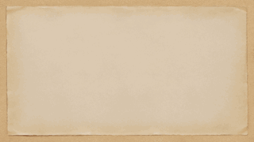

## RE: Canvas 
> 本章不会接触过多的 `WebGL` 知识, 感兴趣的可以等待后续 `WebGL`相关的章节。  
> `BTW`: 在学习之前, 您需要具备一些基本的 `HTML` 与 `JavaScript` 知识。  

> 这里使用 `Canvas` 或者 `canvas` 来表示整体概念, 而带有尖角括号的 `<canvas>` 特指 `HTML` 元素。  

### 一、初识 Canvas
> 为什么不使用 `画布` 这一称呼? 个人喜好🤣

#### 1. 概念
> 接下来是一段枯燥且乏味的基础知识环节~

`<canvas>` 是一个 `HTML` 元素, 它本身**只是**图形容器, 必须使用脚本(通常来说是 `JavaScript`)来绘制图形。拥有多种绘制路径、矩形、圆形、字符以及添加图像的方法, 可以创建丰富的图形引用。例如, 它可以用于绘制图表、制作图片构图或者制作简单的(以及不那么简单的)动画。

`<canvas>` 是一个矩形区域, 可以控制其每一像素。其默认大小为 `300 × 150` 像素(`宽 × 高`, 像素的单位是 `px`)。可以使用 `HTML` 的高度(`height`)和宽度(`width`)属性来自定义 `Canvas` 的尺寸。

#### 2. <canvas> 元素
```html
<canvas class="canvas" id="canvas" width="300" height="150"></canvas>
```

`<canvas>` 标签只有两个特有属性: `width` 和 `height`。而类似于 `class` 与 `id` 标签是每一个 `HTML` 元素都默认具有的属性。

`<canvas>` 标签也可以通过 `css` 来修改样式。**但是**, 这些样式不会影响在 `<canvas>` 中的实际图像。当没有为 `<canvas>` 定制样式时, 它是完全透明。

#### 3. 回退机制
`<canvas>` 本身支持回退机制。当在某些较老的浏览器(尤其是 `IE9` 之前的 `IE` 浏览器)或者[纯文本浏览器](https://baike.baidu.com/item/%E7%BA%AF%E6%96%87%E6%9C%AC%E6%B5%8F%E8%A7%88%E5%99%A8/8789704?fr=aladdin)中使用 `<canvas>` 时, 在这些浏览器上能展示替代内容。

使用起来很容易, 只是在 `<canvas>` 标签中提供了替换内容。而这个原理也非常简单: 当支持 `<canvas>` 的浏览器渲染时, 会自动忽略标签内内容, 只是正常渲染 `<canvas>`; 而不支持的浏览器自然会忽略无法识别的 `<canvas>` 标签渲染其中的内容。

通常使用 `<canvas>` 时都会在其中填写一段类似的话, 例如:
```html
<canvas class="canvas" id="canvas" width="300" height="150">
    Your browser does not support canvas, please use modern browser!
</canvas>
```

如果可以确定 `<canvas>` 只会运行在现代浏览器中或者不考虑回退机制, 也可以不书写回退内容: `<canvas class="no-bug" id="no-bug"></canvas>`。

**⚠️注意**: `</canvas>` 不能省略! 这是由回退机制决定的。如果被省略, 现代浏览器不会渲染 `<canvas>` 之后的所有内容。

### 二、基础用法
#### 1. 渲染上下文
`<canvas>` 元素创造了一个固定大小的区域, 它公开了**一个或多个渲染上下文**, 其可以用来绘制和处理要展示的内容。`canvas` 起初是空白的。为了展示, 首先需要找到渲染上下文, 然后在它的上面绘制。

通过 `getContext()` 获取上下文, 这里主要研究 `2d` 范畴, 所以使用 `canvas.getContext('2d')`, 获取 `CanvasRenderingContext2D` 接口, 该接口为 `Canvas API` 的一部分。

例子:
```js
const canvas = document.getElementById('canvas');
const ctx = cnavas.getContext('2d');
```

#### 2. 支持检测与回退
替换内容是用于在不支持 `<canvas>` 标签的浏览器中展示的。通过简单的测试 `getContext()` 方法的存在, 可以检查 `JavaScript` 编程支持性同时定制一些回退方案(如果不满足于展示一条不支持信息的话)。如:
```js
const canvas = document.getElementById('canvas');
if(canvas.getContext) {
    const ctx = cnavas.getContext('2d');
}else {
    // fallback codes
}
```

#### 3. 简单的完整示例 —— 画个小房子
`HTML`:
```html
<!DOCTYPE html>
<html lang="en">
<head>
    <meta charset="UTF-8">
    <meta name="viewport" content="width=device-width, initial-scale=1.0">
    <title>Canvas Demo</title>
</head>
<body>
    <canvas id="my-canvas" width="300" height="300">
        Your browser does not support canvas, please use modern browser!
    </canvas>
    <script src="./canvas.js"></script>
</body>
</html>
```

`canvas.js`:
```js
window.onload = function () {
    const canvas = document.getElementById('my-canvas');
    if (canvas.getContext) {
        const ctx = canvas.getContext('2d');
        // Set line width
        ctx.lineWidth = 10;

        // Wall
        ctx.strokeRect(75, 140, 150, 110);

        // Door
        ctx.fillRect(130, 190, 40, 60);

        // Roof
        ctx.beginPath();
        ctx.moveTo(50, 140);
        ctx.lineTo(150, 60);
        ctx.lineTo(250, 140);
        ctx.closePath();
        ctx.stroke();
    } else {
        // fallback codes
    }
}
```
效果图:


看完这个小的 `demo` 是不是很激动? 让我们继续学习吧!
> 潜台词: 不激动? 不激动的可以闪了🔪

### 三、绘制形状
#### 1. 坐标系


`x` 和 `y` 轴正方向与浏览器窗口一致(了解: `WebGL` 中 `y` 轴方向相反), 坐标系原点为 `<canvas>` 左上角。

#### 2. 绘制矩形
