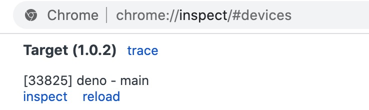
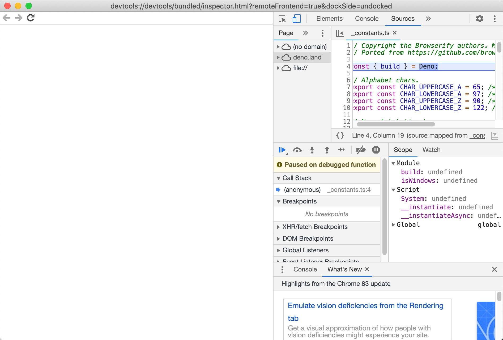
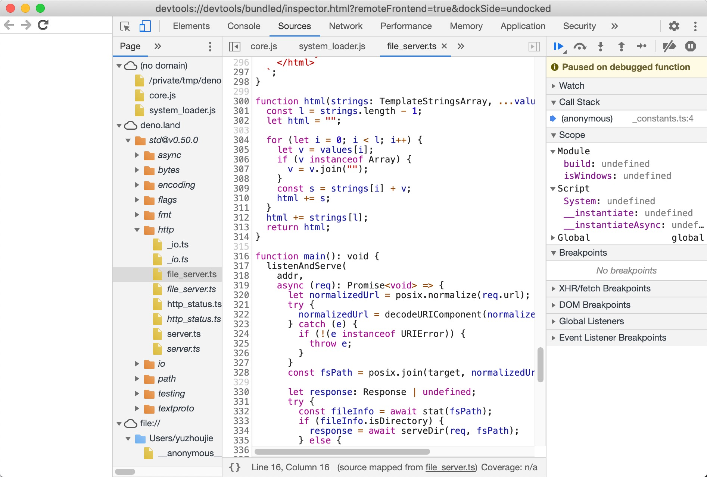
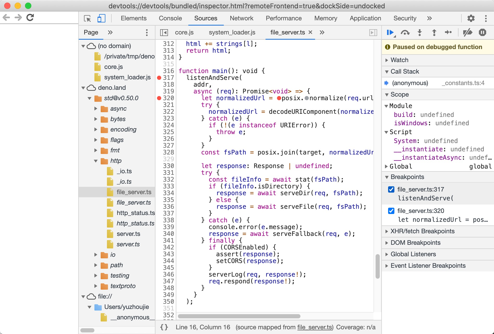
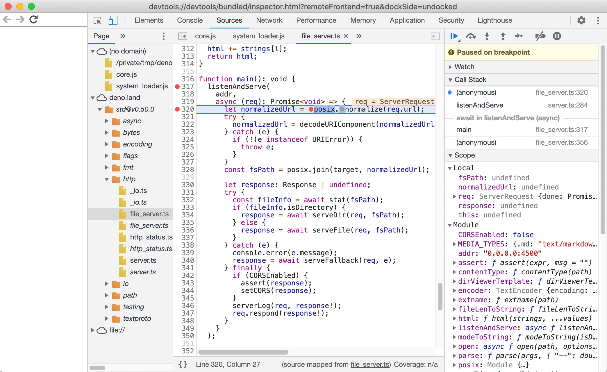
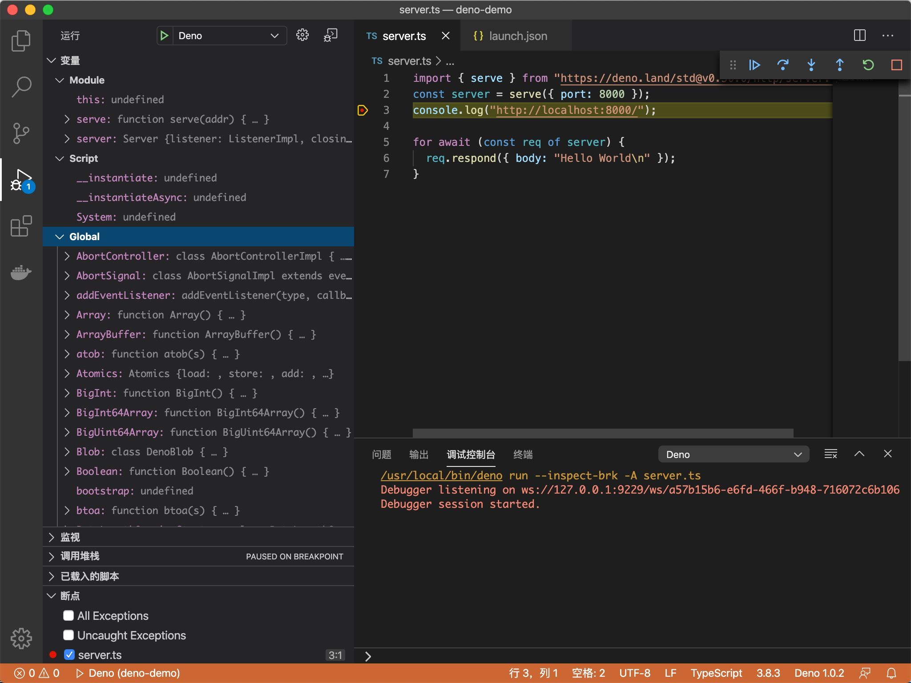

`Deno` 支持[V8检查器协议](https://v8.dev/docs/inspector)。

可以使用 `Chrome Devtools` 或其他支持该协议的客户端(例如 `VSCode`)来调试 `Deno` 程序。

要激活调试功能, 请使用 `--inspect` 或 `--inspect-brk` 标志运行 `Deno`。

`--inspect` 标志允许在任何时间点附加调试器, 同时 `--inspect-brk` 将等待附加调试器并暂停第一行代码的执行。

### Chrome Devtools
让我们尝试使用 `Chrome Devtools` 调试程序。为此, 我们将使用 `std` 中的[file_server.ts](https://deno.land/std@v0.50.0/http/file_server.ts)。一个静态文件服务器。

使用 `--inspect-brk` 标志中断第一行的执行。
```shell
deno run --inspect-brk --allow-read --allow-net https://deno.land/std@v0.50.0/http/file_server.ts
Debugger listening on ws://127.0.0.1:9229/ws/1e82c406-85a9-44ab-86b6-7341583480b1
Download https://deno.land/std@v0.50.0/http/file_server.ts
Compile https://deno.land/std@v0.50.0/http/file_server.ts
...
```

打开 `chrome://inspect` 并单击 `Inspect`:


> 译者注: 可能需要等一阵子才能显示, 可以尝试反复刷新

打开 `devtools` 可能需要几秒钟来加载所有模块。


您可能会注意到 `Devtools` 在_constants.ts代替的第一行暂停了执行 file_server.ts。这是一种预期的行为，是由V8评估ES模块的方式引起的（_constants.ts是V8 的最左，最底层依赖性，file_server.ts因此首先对其进行评估）。

您可能注意到 `Devtools` 在 `_constants.ts` 而不是 `file_server.t` 的第一行暂停了执行。这是一种预期的行为, 是由 `V8` 评估 `ES` 模块的方式引起的(`_constants.ts` 是最左边的, `file_server.ts` 最最底层的依赖项, 所以它首先求值)。

此时, 所有源代码都可以在 `Devtools` 中找到，所以让我们打开 `file_server.ts` 并在其中添加一个断点。转到 `"Sources"` 窗口并展开树:


仔细观察, 您会发现每个文件都都是重复的。一份为正常字体名, 另一份为斜体名。前者是编译后的源文件(因此, 在 `.ts` 文件的情况下, 它将作为 `JavaScript` 源发出), 而后者是该文件的源映射。

在 `listenAndServe` 方法中添加断点:


添加断点后, `Devtools` 会自动打开源映射文件, 这使我们可以逐步浏览包含类型的实际源代码。

现在我们已经设置了断点, 我们可以继续执行脚本, 以便我们可以检查传入的请求。点击恢复脚本执行按钮。您甚至可能需要点击两次。

一旦脚本再次运行, 让我们发送一个请求并在 `Devtools` 中对其进行检查:
```shell
curl http://0.0.0.0:4500/
```


至此, 我们可以查看请求的内容并逐步调试代码。

### VSCode
可以使用VSCode调试Deno。

官方支持的插件正在开发--[https://github.com/denoland/vscode_deno/issues/12](https://github.com/denoland/vscode_deno/issues/12)。

我们仍然可以为 `debugger` 手动提供 `launch.json` 配置:
```json
{
  "version": "0.2.0",
  "configurations": [
    {
      "name": "Deno",
      "type": "node",
      "request": "launch",
      "cwd": "${workspaceFolder}",
      "runtimeExecutable": "deno",
      "runtimeArgs": ["run", "--inspect-brk", "-A", "<entry_point>"],
      "port": 9229
    }
  ]
}
```
**注意**: `<entry_point>` 用实际的脚本名称替换。

这次让我们尝试使用本地源文件, 创建 `server.ts`:
```ts
import { serve } from "https://deno.land/std@v0.50.0/http/server.ts";
const server = serve({ port: 8000 });
console.log("http://localhost:8000/");

for await (const req of server) {
  req.respond({ body: "Hello World\n" });
}
```

更改 `<entry_point>` 为 `server.ts` 并运行创建的配置:


### JetBrains IDE
您可以使用 `JetBrains IDE` 调试 `Deno`, 方法是右键单击要调试的文件并选择 `Debug 'Deno: <file name>'` 选项。这将创建一个未设置权限标志的 `run/debug` 配置, 如果想要进行更改, 您需要修改 `run/debug` 配置并更改 `Arguments` 字段。

### 其他
任何实现 `Devtools` 协议的客户端都应该能够连接到 `Deno` 进程。

### 局限性
`Devtools` 支持仍不成熟, 有一些已知功能缺失/故障:
- `Devtools` 控制台中的自动完成会导致 `Deno` 进程退出
- 分析和内存转储可能无法正常工作